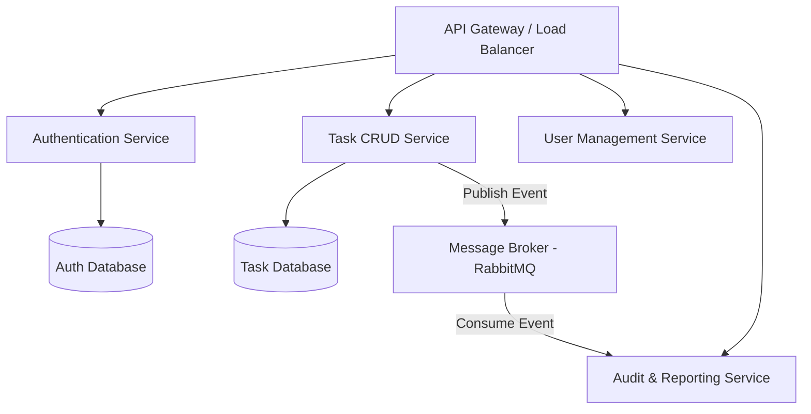

# Scalability and Production Readiness Architecture Note

This document outlines the architectural roadmap for transitioning this monolithic backend API (Node.js/Express/SQLite) into a highly available, fault-tolerant, and horizontally scalable production system.

---

## 1. Database Scaling (Transitioning from SQLite)

While SQLite is excellent for local testing and zero-setup demonstration, scaling requires a robust relational database management system (RDBMS) like **PostgreSQL** or **MySQL**.

- **Managed Database Cluster:** Deploy PostgreSQL on a managed service (e.g., AWS RDS, GCP Cloud SQL) to leverage automated backups, multi-AZ high availability, and failovers.
- **Read Replicas:** Since task systems are typically read-heavy (users checking dashboards), establish one or more read replicas. Direct write operations to the primary node and read queries to the replicas via load-balanced endpoints.
- **Database Connection Pooling:** Express is stateless, and high traffic creates numerous database connections, which can saturate PostgreSQL. Deploy a database proxy like **PgBouncer** or use Prisma's native pooling/connection management to manage the database connection lifecycle efficiently.

---

## 2. API Caching Layer (Redis)

To minimize database queries and reduce API response times, integrate an in-memory database like **Redis** as a caching layer.

- **Session and Profile Caching:** User profiles (`/profile`) change infrequently. Cache them in Redis with a Time-to-Live (TTL) of 1 hour, invalidating the cache when a user updates their name or password.
- **Task List Caching:** Cache the task lists for regular users. To keep stats consistent, use a smart cache invalidation strategy: when a user performs a write action (Create, Update, Delete) on their tasks, clear their cache block.
- **Rate Limiting:** Cache IP request statistics in Redis to prevent brute-force attacks and DDoS attempts using middleware like `express-rate-limit`.

---

## 3. Horizontal Scaling & Stateless Containers

To handle spikes in traffic, the Express server must run in a stateless manner, allowing horizontal scaling across multiple virtual machines or containers.

- **Stateless Design:** Keep all user sessions in the JWT token (or a Redis session store). Never save state (like files or memory locks) locally on the Node process.
- **Containerization (Docker):** Standardize the application environment using Docker. A multi-stage Dockerfile optimizes build sizes and ensures consistent deployment across dev, staging, and production.
- **Orchestration (Kubernetes / AWS ECS):** Deploy Docker containers in clusters. Set up horizontal autoscaling to automatically spin up new task containers when CPU usage crosses a threshold (e.g., 70%).
- **Load Balancing:** Deploy a reverse proxy / load balancer (e.g., NGINX, AWS Application Load Balancer) in front of the server cluster to distribute traffic using round-robin or least-connections algorithms.

---

## 4. Background Processing & Event-Driven Workers

Heavy tasks should never block the main Express event loop, as Node.js is single-threaded.

- **Message Queues:** Integrate a message broker like **RabbitMQ** or a Redis-backed queue like **BullMQ**.
- **Offloading Heavy Logic:**
  - Sending email notifications (registration welcomes, task overdue reminders).
  - Generating CSV/PDF reports of tasks for admin downloads.
  - Logging database audits and user activity metrics.
- **Separate Workers:** Run separate worker processes (written in Node or Go) that consume messages from these queues. This isolates workload failures from disrupting the customer-facing API.

---

## 5. Microservices Transition

If the application features grow larger (e.g., adding project sharing, team chat, document attachments), transition the codebase from a modular monolith to a microservice architecture:

- **Authentication Service:** Dedicated service handling registrations, logins, OAuth2, and JWT validation.
- **Task Service:** Optimized for CRUD queries on tasks.
- **API Gateway:** Implement an API Gateway (e.g., Kong, KrakenD) to handle unified routing, SSL termination, and rate-limiting gates, forwarding requests to downstream services.
